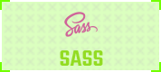
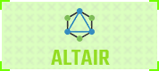

<b>Hello there!</b>

  

### 
I'm Eduard, a passionate full-time application developer from Romania.

  

- 🎮 In my free time I play open world games like Grand Theft Auto, Red Dead Redemption or Assassin's Creed
- 🌱 I’m currently learning Everything, Everywhere, All at Once
- 👨‍💻 All my projects are available in [my portfolio](https://eduardconstantin.github.io)
- ⚡ Fun fact: I like to sketch

  
Click 👆

  <pre>
    <h1 align="center">🤷‍♂️</h1>
    

  </pre>

  

<h3 align="center">⚛ Tech & Tools</h3>

 
  <table>
    <tr>
      <td valign="center" width="100px"><b>Frontend<b></td>
      <td valign="center" width="100px"><b>Dev<b></td>
    </tr>
    <tr>
      <td valign="center" align="center" width="370px">
        
         
          
         
        
        
          
          
          
         
         
        
        
      </td>
      <td valign="center" align="center" width="370px">
        
        
        
        
        
         
      </td>
    </tr>
  </table>
  
 <table>
    <tr>
      <td valign="center" width="100px"><b>Backend<b></td>
      <td valign="center" width="100px"><b>Design<b></td>
    </tr>
    <tr>
      <td valign="center" align="center" width="370px">
         
          
          
        
     </td>
     <td valign="center" align="center" width="370px">
         
         
          
      </td>
    </tr>
  </table>

  

  
  
    

  

